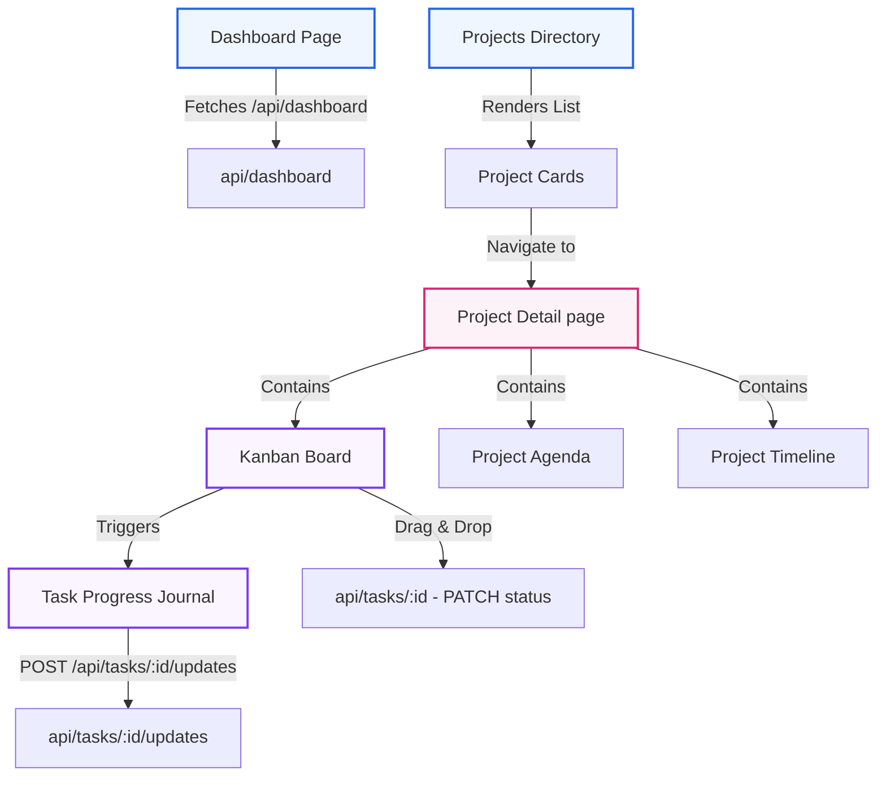
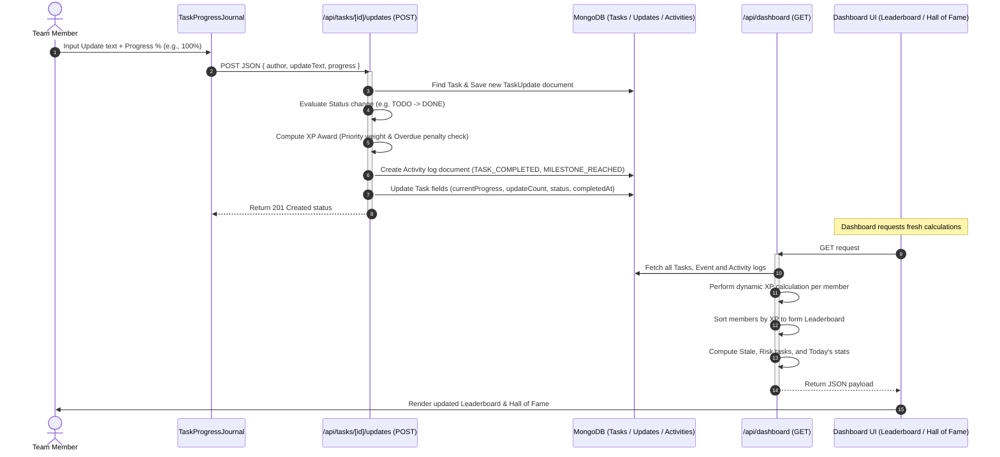
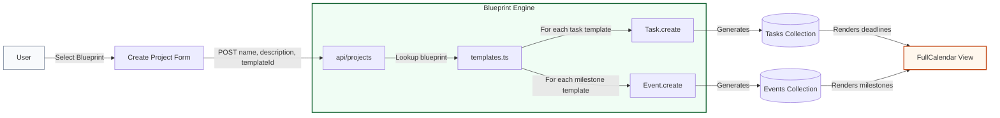

# Architecture Documentation

This document explains the high-level architecture, database schema layouts, and data lifecycles of **DevChart**. It serves as a guide to understanding how frontend views, API endpoints, database collections, and background rules interact.

---

## High-Level Diagrams

### 1. System Structure
This diagram details the static containment and connection hierarchy between the primary entities in DevChart.



---

### 2. Data Flow & Aggregation
This diagram illustrates the lifecycle of a single progress update—from input to XP recalculation and leaderboard rendering.



---

### 3. Blueprint Flow
This diagram details the generation flow when bootstrapping a project from a template.



---

## API Surface

The Next.js backend exposes the following API routes to handle data synchronization, dashboard calculations, and project templates creation:

| HTTP Method | Route | Purpose | Payload (Request/Response) |
| :--- | :--- | :--- | :--- |
| **GET** | [/api/dashboard](src/app/api/dashboard/route.ts) | Computes global dashboard statistics, developer XP leaderboard, recent activity log, and automation warnings. | **Response**: JSON containing stats, charts, timeline, leaderboard, and automation alerts. |
| **GET** | [/api/projects](src/app/api/projects/route.ts) | Fetches all projects, calculating dynamic health scores and next event dates for each. | **Response**: List of project objects with dynamic operational stats. |
| **POST** | [/api/projects](src/app/api/projects/route.ts) | Creates a project from a blueprint (or a custom project), provisioning tasks and milestones automatically. | **Request**: `{ name, description, templateId }`<br>**Response**: Created project object. |
| **GET** | [/api/projects/[id]/tasks](src/app/api/projects/[id]/tasks/route.ts) | Lists tasks specifically associated with the project `id`. | **Response**: Task documents. |
| **GET** | `/api/events` | Fetches all Scheduled Meetings, Events, and Milestones to render on FullCalendar. | **Response**: List of event objects. |
| **POST** | `/api/events` | Registers a new meeting or event directly from the calendar interface. | **Request**: `{ title, startDate, type, projectId }`<br>**Response**: Created event. |
| **DELETE**| `/api/events/[id]` | Deletes a scheduled calendar event by ID. | **Response**: Success status. |
| **GET** | [/api/tasks](src/app/api/tasks/route.ts) | Fetches all tasks across the system for the global Calendar integration. | **Response**: List of task objects. |
| **POST** | [/api/tasks](src/app/api/tasks/route.ts) | Adds a new task manually to a specific project. | **Request**: `{ projectId, title, description, priority, assignedTo, dueDate }` |
| **PATCH** | [/api/tasks/[id]](src/app/api/tasks/[id]/route.ts) | Modifies properties of a task (e.g. status, assignee) and generates activity feed entries. | **Request**: Partial task object (e.g., `{ status: "DONE" }`) |
| **GET** | [/api/tasks/[id]/updates](src/app/api/tasks/[id]/updates/route.ts) | Fetches the history of progress updates posted under task `id`. | **Response**: List of update logs. |
| **POST** | [/api/tasks/[id]/updates](src/app/api/tasks/[id]/updates/route.ts) | Appends a new progress update, increments task counters, updates status, and logs activities. | **Request**: `{ author, updateText, progress }` |

---

## Database Modeling

DevChart uses **Mongoose** to interact with a MongoDB instance. The system models club operations using five interrelated schemas:

```
Project
├── Tasks (Linked via projectId)
│     └── Task Updates (Linked via taskId)
├── Events (Linked via projectId)
└── Activities (Linked via projectId & taskId)
```

### 1. Project Schema
* **Purpose**: Represents a distinct team objective or organizational unit (e.g., a Hackathon).
* **Fields**:
  * `_id` (ObjectId): Unique identifier.
  * `name` (String, required): The project title.
  * `description` (String, optional): Explanation of objectives.
  * `templateId` (String, optional): The ID of the blueprint template if bootstrapped.
  * `createdAt` (Date): Creation timestamp.

### 2. Task Schema
* **Purpose**: An actionable item within a project.
* **Fields**:
  * `projectId` (ObjectId, ref `Project`, required): The project this task belongs to.
  * `title` (String, required): Actionable summary.
  * `description` (String, optional): Details and context.
  * `status` (String, Enum `["TODO", "IN_PROGRESS", "DONE"]`): Progress tracking column.
  * `priority` (String, Enum `["Low", "Medium", "High"]`): Priority tier.
  * `dueDate` (Date, optional): Timeline deadline.
  * `assignedTo` (String, optional): Selected member from hardcoded team list.
  * `completedAt` (Date, optional): Timestamp when the task hit 100% progress.
  * `currentProgress` (Number, 0-100): Percentage completed.
  * `updateCount` (Number): Total updates posted.
  * `latestUpdatePreview` (String): Truncated text from the last update.
  * `updatedAt` (Date): Last activity timestamp.
  * `createdAt` (Date): Creation timestamp.

### 3. TaskUpdate Schema (Progress Journal)
* **Purpose**: Records a contextual status change logged by a member.
* **Fields**:
  * `taskId` (ObjectId, ref `Task`, required): Associated task.
  * `author` (String, required): Contributor logging the progress.
  * `updateText` (String, required): Plain text details of what was accomplished.
  * `progress` (Number, 0-100): Progress snapshot at submission.
  * `createdAt` (Date): Entry creation timestamp.

### 4. Event Schema
* **Purpose**: Tracks meetings, milestones, and planning landmarks scheduled on the FullCalendar.
* **Fields**:
  * `title` (String, required): Name of the meeting or milestone.
  * `description` (String, optional): agenda or details.
  * `type` (String, Enum `["MEETING", "EVENT", "MILESTONE"]`): Category of entry.
  * `startDate` (Date, required): Date scheduled.
  * `endDate` (Date, optional): Duration end date.
  * `projectId` (ObjectId, ref `Project`, optional): Parent project scope, if applicable.
  * `createdAt` (Date): Creation timestamp.

### 5. Activity Schema
* **Purpose**: An immutable audit log of actions feeding the real-time operational activity stream.
* **Fields**:
  * `taskId` (ObjectId, ref `Task, optional): Associated task if status-based.
  * `projectId` (ObjectId, ref `Project`, optional): Associated project.
  * `type` (String, Enum `["TASK_CREATED", "TASK_COMPLETED", "TASK_ASSIGNED", "STATUS_CHANGED", "EVENT_CREATED", "MILESTONE_CREATED", "MILESTONE_REACHED", "PROJECT_CREATED", "TASK_PROGRESS_UPDATE", "TASK_PROGRESS_STALE"]`): Type of operational change.
  * `taskTitle` / `eventTitle` / `projectName` (String): De-normalized snapshots for fast dashboard aggregates.
  * `previousStatus` / `newStatus` (String): Captures column transitions.
  * `assignedTo` (String): Member trigger.
  * `xpAwarded` (Number): Quantified points for gamified ranking.
  * `action` (String): Formatted text description for user feed display.
  * `createdAt` (Date): Creation timestamp.

---

## Dynamic Calculations & Aggregations

To optimize data integrity and minimize sync errors, DevChart relies on **on-the-fly calculations** in API routes rather than storing pre-computed counts.

### 1. Weighted Project Health Score
The health score is computed dynamically in [api/projects/route.ts](src/app/api/projects/route.ts) based on a weighted combination of task completion count, average task progress, and on-time status rates:
$$\text{Health Score} = (\text{Completed \%} \times 0.5) + (\text{Average Progress} \times 0.2) + (\text{On-Time Rate} \times 0.3)$$

Where:
* **Completed %**: Percentage of tasks in the `DONE` status.
* **Average Progress**: Sum of progress percentages of all tasks divided by task count. (DONE tasks are treated as $100\%$).
* **On-Time Rate**: The percentage of tasks that are either:
  * Complete and finished on or before their due date (`completedAt <= dueDate`).
  * Incomplete, but the current date has not passed the due date (`now <= dueDate`).
  * Scheduled without any due date (automatically treated as on-time).

### 2. Gamified Contributor XP Algorithm
XP is derived dynamically from Completed Tasks in [api/dashboard/route.ts](src/app/api/dashboard/route.ts). When a task is marked `DONE`, points are calculated:
* **Base Points by Priority**:
  * `Low`: +5 XP
  * `Medium`: +10 XP
  * `High`: +20 XP
* **Overdue Penalty**:
  * If `completedAt > dueDate`, **-5 XP** is deducted from the base points.

### 3. Automation Engine Triggers
Operational alerts are computed in the [api/dashboard/route.ts](src/app/api/dashboard/route.ts) payload:
* **Risk Tasks**: Active, unfinished tasks (`status != "DONE"`, `progress < 70%`) due in the next **48 hours** (`dueDate <= now + 48h`). High-severity risk triggers if due within **24 hours** and progress is under **30%**.
* **Stale Tasks**: Tasks in `IN_PROGRESS` status that have not received a progress update or task edit in the last **7 days** (`updatedAt < now - 7 days`).
* **Completed Milestones**: Triggered when a task's progress cross 100% or reaches key increments (25%, 50%, 75%) inside the task updates API logic, instantly generating milestone completion logs.
