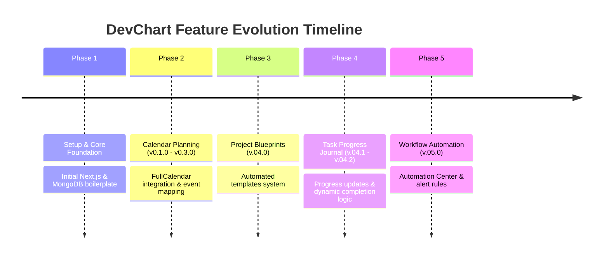

# Project Evolution Changelog

This document tracks the chronological development history of **DevChart**, mapping git tags and commits to their respective release features. Each release includes a **Problem/Solution Analysis** outlining the core product thinking behind its addition.

---

## Release Timeline Summary

---

## Version Details

### v.05.0 - Workflow Automation Added
* **Commit**: `3ac433e`
* **Release Objective**: Introduce real-time operational alerts for stale tasks and overdue project deadlines.
* **Problem / Solution Analysis**:
  * **The Problem**: Project leads were spending hours manually checking task boards to identify which tasks were stuck, causing at-risk deadlines to go unnoticed until it was too late.
  * **The Solution**: An in-memory **Automation Center** that dynamically scans MongoDB collections to flag stale tasks (inactive for >7 days) and deadlines at risk (due in <48 hours with progress <70%), surfacing these warnings instantly to the team.

---

### v.04.2 - Task Progress Journal Added
* **Commit**: `f6709c1`
* **Release Objective**: Build a unified audit trail for tasks, allowing detailed text updates and progress slider adjustments.
* **Problem / Solution Analysis**:
  * **The Problem**: Moving tasks between "To Do", "In Progress", and "Done" didn't explain *what* was actually accomplished, leaving the rest of the team in the dark.
  * **The Solution**: A **Progress Journal** component that logs written updates and progress percentages. Each submission creates a new timestamped update in a scrollable timeline, building a clear record of progress.

---

### v.04.1 - Dynamic Task Completion
* **Commit**: `daded0c`
* **Release Objective**: Automatically update task status based on progress journal entries.
* **Problem / Solution Analysis**:
  * **The Problem**: Forcing users to manually move a Kanban card and log a progress update was repetitive and often led to mismatched data (e.g. logging a "100% complete" update while the task stayed in "In Progress").
  * **The Solution**: Connected the Progress Journal to the Task Status state. Hitting 100% progress automatically marks the task as `DONE` and records `completedAt`, while reducing progress below 100% moves it back to `IN_PROGRESS`.

---

### v.04.0 - Project Templates & Blueprints Added
* **Commit**: `5ed9013`
* **Release Objective**: Provide pre-configured template profiles for common club activities to speed up project creation.
* **Problem / Solution Analysis**:
  * **The Problem**: Creating projects from scratch was tedious, requiring leads to manually type out repetitive tasks and milestones for standard activities like Hackathons or workshops.
  * **The Solution**: Introduced **Project Blueprints**. Bootstrapping a project with a template (e.g. Hackathon, Recruitment, Tech Fest) automatically populates it with pre-defined tasks and milestones, calculating due dates dynamically using relative offsets.

---

### v0.1.0 - v0.3.0 - Calendar Module Integration
* **Commit**: `a4440d6`
* **Release Objective**: Implement a planning calendar to visualize project milestones and task deadlines on a single timeline.
* **Problem / Solution Analysis**:
  * **The Problem**: Kanban boards track immediate tasks, but fail to show the bigger picture, making it hard to see when deadlines cluster or conflict.
  * **The Solution**: Integrated **FullCalendar** to display meeting events, milestones, and task deadlines side-by-side. Included a **Quick Add Event** form to let users quickly schedule meetings or add tasks directly from the calendar.

---

### Phase 1 - MongoDB Setup & Core Task Manager
* **Commits**: `951b3b1`, `8d86c7b`, `44a5f63`
* **Release Objective**: Establish the database connection and build a basic full-stack task manager.
* **Problem / Solution Analysis**:
  * **The Problem**: The initial Next.js boilerplate lacked database persistence and task management features, serving only as a static webpage.
  * **The Solution**: Configured **MongoDB & Mongoose**, established server-side connection utility patterns, and built API routes to handle task creation and display.
