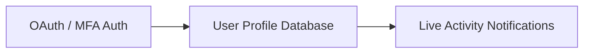
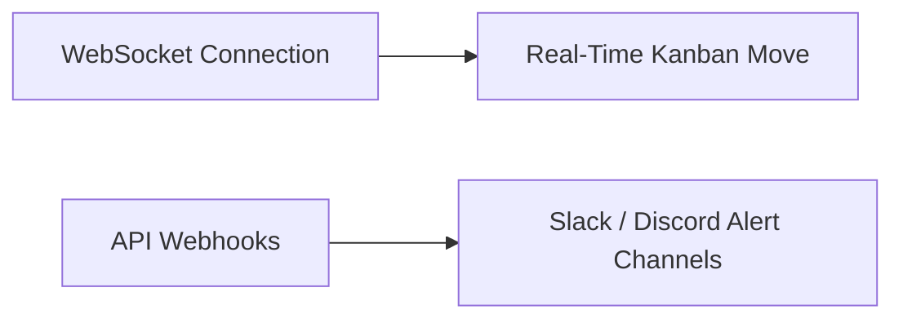
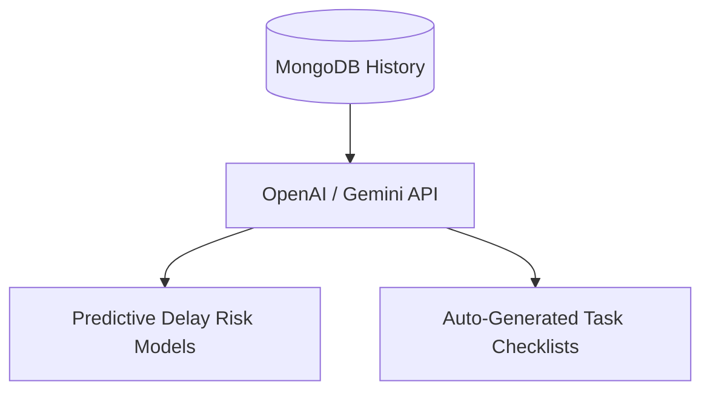

# Engineering Tradeoffs & Future Roadmap

This document outlines the engineering decisions made for the 48-hour recruitment scope, explaining how these choices saved time while delivering a high-quality product. It also maps out a prioritized roadmap for future upgrades.

---

## Engineering Tradeoffs

To deliver a feature-rich product within a tight 48-hour window, several deliberate engineering tradeoffs were made. These decisions prioritize **high-value, visible user features** over complex, hidden backend infrastructure.

### 1. No Authentication System
* **Decision**: Skipped user login, session management, and auth tokens, leaving all routes publicly accessible.
* **Alternative Cost**: Implementing a secure auth flow (e.g. NextAuth.js or Clerk) with user profiles and password hashing would take 6-8 hours of setup and testing.
* **Why it Maximizes Value**: Allowed us to focus that time on the Kanban board, FullCalendar integration, and the Automation Center.
* **Production Path**: Add NextAuth.js with GitHub/Google OAuth providers, wrapping API routes in middleware to restrict access.

### 2. Hardcoded Team Members
* **Decision**: Hardcoded team members ("Devangshu", "Alex", "Taylor", "Jordan") in a client-side utility list ([constants.ts](src/lib/constants.ts)) instead of building a dynamic user database.
* **Alternative Cost**: Designing member schemas, group invites, permission levels, and management screens would require extensive database design and UI building.
* **Why it Maximizes Value**: Simplifies task assignments and status updates in dropdowns, keeping the focus on core collaboration workflows.
* **Production Path**: Create a `Member` model in MongoDB, linking tasks to member object IDs instead of raw strings.

### 3. Dynamic Aggregations instead of a MemberStats Collection
* **Decision**: Computed all leaderboards, XP scores, and project health metrics dynamically on-the-fly inside [/api/dashboard](src/app/api/dashboard/route.ts) rather than maintaining a separate `MemberStats` cache collection.
* **Alternative Cost**: Setting up collection-sync listeners or database triggers to update cached stats on every task edit.
* **Why it Maximizes Value**: Prevents out-of-sync data bugs and keeps the database architecture clean. Since club databases are small, dynamic calculation is fast and efficient.
* **Production Path**: Introduce redis caching or incremental database updates for stats as the team scales to thousands of active tasks.

### 4. Lightweight inline Automations instead of a Workflow Queue
* **Decision**: Scanned and calculated stale and at-risk tasks dynamically on page load instead of using background cron jobs or message queues.
* **Alternative Cost**: Setting up Redis/BullMQ or cron servers to process tasks in the background.
* **Why it Maximizes Value**: Zero external dependencies and simple deployment. The automation calculations scale well for typical team workloads.
* **Production Path**: Use a cron server (e.g., node-cron or Vercel Cron Jobs) to run daily risk reports and dispatch notifications.

### 5. Polling instead of WebSockets / Real-Time Sync
* **Decision**: Relied on page transitions and UI actions to trigger data fetches, rather than WebSockets.
* **Alternative Cost**: Setting up a Socket.io server, configuring CORS, and managing real-time connections.
* **Why it Maximizes Value**: Saves infrastructure complexity and simplifies local setup.
* **Production Path**: Integrate pusher.com or socket.io to push real-time updates when tasks move or updates are posted.

### 6. No File Attachments on Tasks / Updates
* **Decision**: Omitted attachment uploads (e.g. uploading screenshots of completed UI, PDF flyers for events, spreadsheet reports).
* **Alternative Cost**: Setting up S3 buckets, creating upload API routes, configuring IAM policies, implementing multi-part forms, and handling file deletion synchronization.
* **Why it Maximizes Value**: Upload infrastructure requires substantial setup time and credentials management. Omitting it kept the application self-contained and focused on meta-documentation (Progress Journal entries).
* **Production Path**: Integrate an upload utility using Cloudinary or AWS S3 presigned URLs, saving file references to a `attachments` array in the `Task` and `TaskUpdate` models.

---

## Future Roadmap

The roadmap is divided into Near-Term, Mid-Term, and Long-Term releases, showing a clear path to scale DevChart into an enterprise-ready platform.

### Near-Term (1-3 Months)

* **Authentication**: Integrate NextAuth.js to secure projects, limit administrative actions, and automatically assign task updates to the logged-in user.
* **In-App Notifications**: Add a notification bell and a user settings panel to alert members when they are assigned a task or when their task is flagged as stale.

---

### Mid-Term (3-6 Months)

* **Real-Time Collaboration**: Use WebSockets (Pusher or Socket.io) to enable multiplayer editing, syncing Kanban movements and progress updates instantly across open screens.
* **Chat Integration**: Add project-specific chat channels using WebSockets, allowing team members to discuss tasks directly beside the progress logs.
* **Third-Party Integrations**: Build webhook listeners to sync task completion alerts to Slack or Discord channels.

---

### Long-Term (6+ Months)

* **Visual Workflow Builder**: Replace static project blueprints with a drag-and-drop workflow designer, letting leads set up automated sequences (e.g. "When a task moves to DONE, automatically create a review task").
* **AI Project Insights**: Use LLMs (Gemini / OpenAI API) to summarize weekly updates from the progress journal, draft status reports, and highlight project bottlenecks automatically.
* **Predictive Delay Detection**: Train simple regression models on historical task completion times to predict future delays before they happen.
