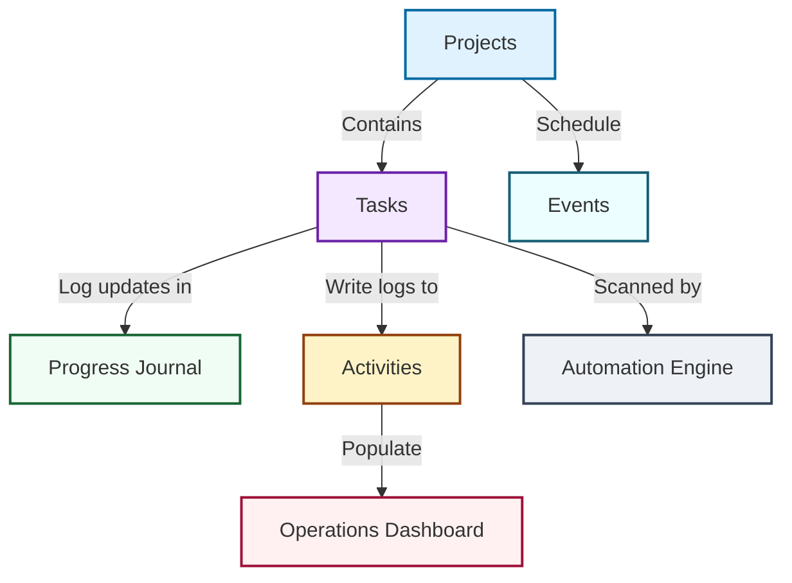
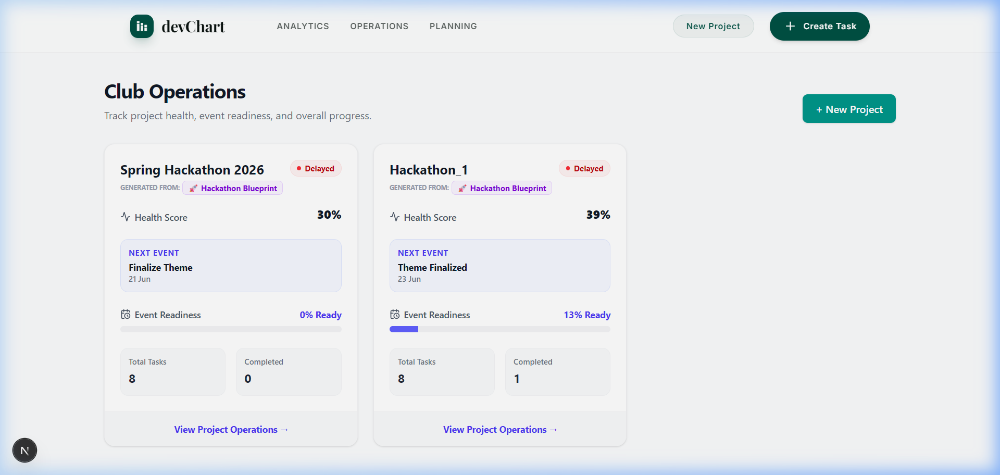
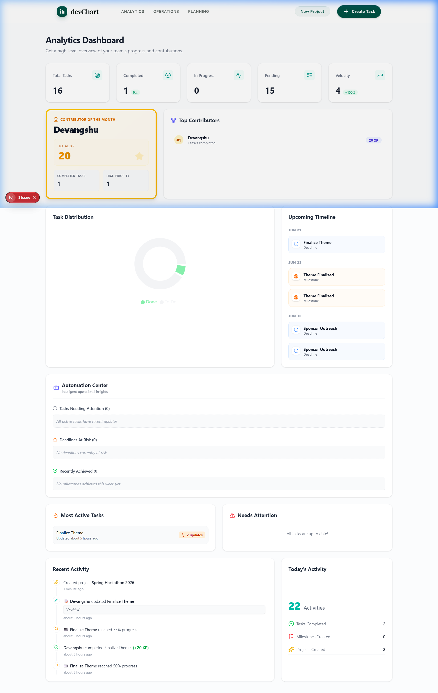
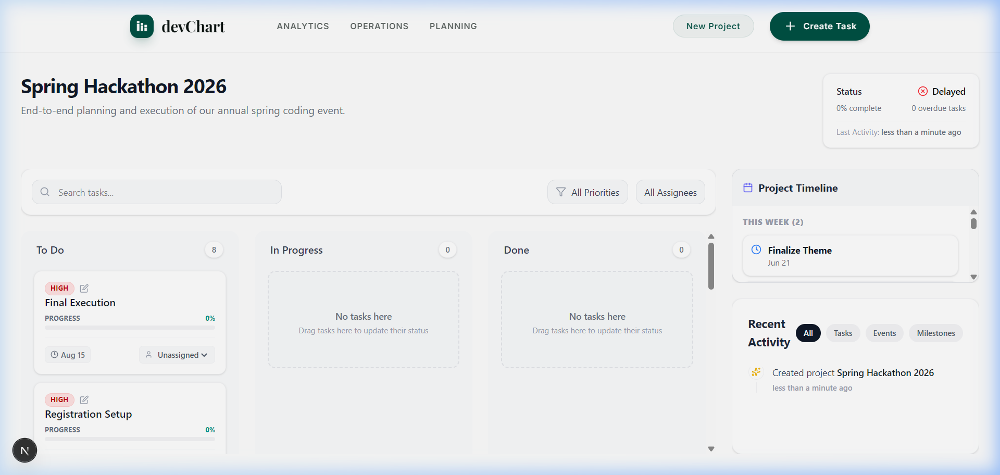
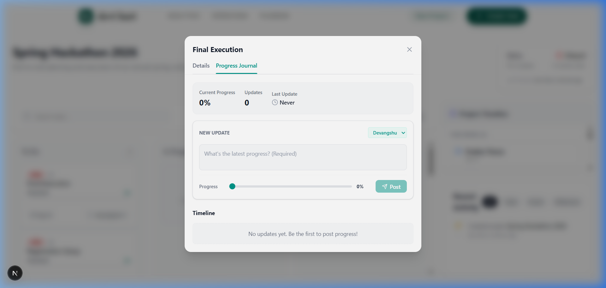
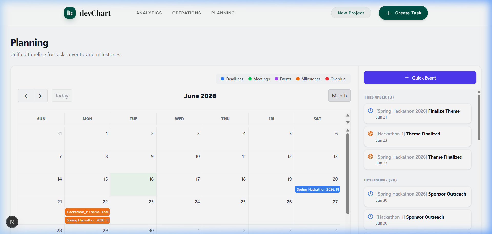

# DevChart: The Club Operating System (Club OS)

[](#)
[](#)
[](#)
[](#)
[](#)

---

## Why This Project Exists

Student clubs and high-velocity teams frequently manage events, recruitment drives, hackathons, workshops, and competitions using disconnected tools (Trello for tasks, Google Calendar for schedules, Slack for notifications, and Excel sheets for contribution tracking). This fragmentation leads to:
* **Stagnant Tasks**: No visibility into whether work has stopped or is progressing.
* **Deadline Blindspots**: Overdue tasks discovered too late, delaying event launches.
* **Unequal Contributions**: Lack of real-time gamification and recognition leads to uneven member participation.

**DevChart** unifies planning, execution, visibility, operational alerting, and contribution tracking inside a single, cohesive **Club Operating System (Club OS)**. It translates static task cards into an active team environment, tracking project readiness, rewarding contributor participation with XP points, and identifying process risk automatically.

---

## Architecture Snapshot



---

## Screenshots

### 1. Club Operations Dashboard


### 2. Analytics & Contribution Dashboard


### 3. Kanban Project Execution Board


### 4. Task Progress Journal Timeline


### 5. Planning Calendar & Event Timeline


---

## Key Features

✅ **Kanban Project Management**: Drag-and-drop task organization (via `dnd-kit`) with customizable priority tags and progress bars.

✅ **FullCalendar Planning Hub**: Integrated monthly calendar view merging event milestones and task deadlines side-by-side.

✅ **Project Blueprint System**: One-click project creation that automatically populates common task and milestone structures with dynamic dates.

✅ **Contributor Leaderboards & Hall of Fame**: A gamified points engine (XP) that rewards contributions, penalizes overdue work, and highlights top team members.

✅ **Automation Center**: Real-time scanners that flag stale tasks, highlight near-term risk deadlines, and celebrate achieved completion.

✅ **Task Progress Journals**: Scrollable, detailed text update streams with progress sliders (0% to 100%) that dynamically transition task columns.

✅ **Project Health Scoring**: Weighted algorithm calculating operational project statuses dynamically from task counts, completion states, and deadlines.

---

## Technology Stack

| Layer | Technologies | Purpose |
| :--- | :--- | :--- |
| **Core Framework** | Next.js 16 (App Router), React 19, TypeScript | Server-Side Rendering (SSR) & dynamic API routes |
| **Styling** | TailwindCSS v4, Vanilla CSS, Lucide Icons | Responsive grid layouts, modern typography, sleek design tokens |
| **State & Drag-and-Drop** | `@dnd-kit/core`, `@dnd-kit/sortable` | Fluid Kanban board drag-and-drop task status updates |
| **Data Visualization** | Recharts | Dynamic task distribution charts and velocity gauges |
| **Calendar Engine** | FullCalendar v6 | Integrated planning timeline merging deadlines and meetings |
| **Database & ORM** | MongoDB, Mongoose | Schema definitions and real-time operational aggregates |

---

## Quick Start Guide

### Prerequisites
* [Node.js](https://nodejs.org) (v18 or higher recommended)
* A [MongoDB connection string](https://www.mongodb.com/cloud/atlas) (local or Atlas cloud instance)

### 1. Clone & Install
```bash
# Clone the repository
cd devChart

# Install dependencies
npm install
```

### 2. Environment Configuration
Create a `.env.local` file in the root of the project:
```env
MONGODB_URI=mongodb+srv://<username>:<password>@cluster.mongodb.net/devchart?retryWrites=true&w=majority
NEXT_PUBLIC_BASE_URL=http://localhost:3000
```

### 3. Running Locally
Launch the Next.js development server:
```bash
npm run dev
```
Open [http://localhost:3000](http://localhost:3000) in your browser to view the application.

### 4. Build for Production
Verify typescript compilation and build the optimized production output:
```bash
npm run build
```

---

## Documentation Map

To fully explore the engineering design, decisions, capabilities, and setup of the DevChart platform, read the following dedicated files:

1. 📂 **[SHOWCASE.md](SHOWCASE.md)**: The 5-Minute Recruiter Demo Tour. Walkthrough of the application features.
2. 📂 **[DECISIONS.md](DECISIONS.md)**: Rationale behind key architectural choices, compromises, and dependency selection.
3. 📂 **[ARCHITECTURE.md](ARCHITECTURE.md)**: System design diagrams, database schemas, dynamic formulas, and data lifecycle flow.
4. 📂 **[FEATURES.md](FEATURES.md)**: Comprehensive breakdown of capabilities with Recruiter Demonstration Value mappings.
5. 📂 **[CHANGELOG.md](CHANGELOG.md)**: Chronological project timeline derived from actual git commits, highlighting problem-solution context.
6. 📂 **[FUTURE_ROADMAP.md](FUTURE_ROADMAP.md)**: Engineering tradeoffs (auth, static members, dynamics) and prioritized Near-Term, Mid-Term, and Long-Term roadmaps.
